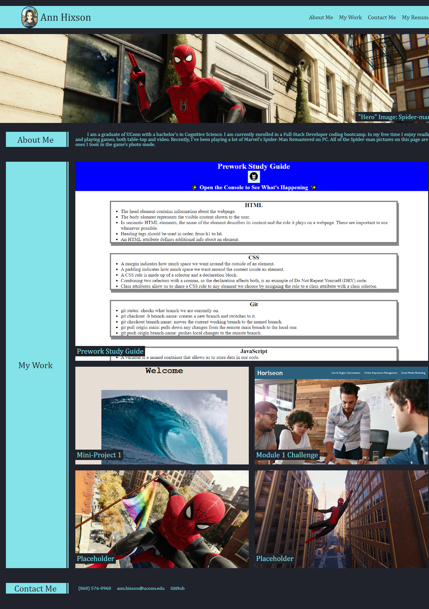

# module-2-challenge

## Description

The purpose of Module 2 Challenge was to create a portfolio of my work as a developer that can be used throughout my career. It was to be created using, and thus reinforcing, what we learned about both HTML and CSS, with a focus on advanced CSS styling techniques.

## Installation

N/A

## Usage

The page is very responsive, adapting as the size is increased/decreased. The links in the nav bar that relate to sections on the page link to them when clicked. The links to my work connect to the deployed applications.

The page appears as follows:

and can be found at the following link: [https://annhixson.github.io/module-2-challenge/](https://annhixson.github.io/module-2-challenge/)

## Credits

Templates:  
- Reset CSS template is from [https://meyerweb.com/eric/tools/css/reset/](https://meyerweb.com/eric/tools/css/reset/)  
- README template is from [https://coding-boot-camp.github.io/full-stack/github/professional-readme-guide](https://coding-boot-camp.github.io/full-stack/github/professional-readme-guide)

Code:  
- hover glow code from: the module 2 mini-project from this course

How to's:
- How to make an image a link: [https://www.tutorialspoint.com/How-to-use-an-image-as-a-link-in-HTML#:~:text=To%20use%20image%20as%20a,add%20the%20height%20and%20width.](https://www.tutorialspoint.com/How-to-use-an-image-as-a-link-in-HTML#:~:text=To%20use%20image%20as%20a,add%20the%20height%20and%20width.)
- How to crop images in CSS: [https://www.digitalocean.com/community/tutorials/css-cropping-images-object-fit](https://www.digitalocean.com/community/tutorials/css-cropping-images-object-fit)
- Width: 100% vs. margin-right solution: [https://stackoverflow.com/questions/9877379/margin-right-broken-on-width-100](https://stackoverflow.com/questions/9877379/margin-right-broken-on-width-100)

Images:
- Spider-man images taken by me in the photo mode of Marvel's Spider-Man Remastered on PC.
- My avatar was created by me on [dolldivine.com](dolldivine.com/mega-anime-avatar-creator.php). Artwork by: PRINCEOFREDROSES. Game by: RINMARU.

## License

N/A
